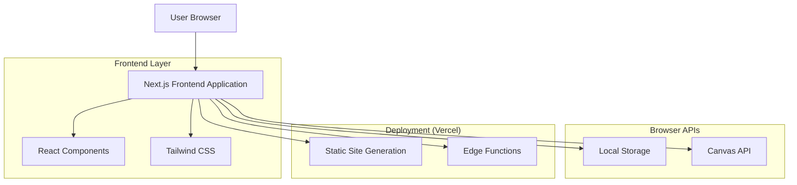
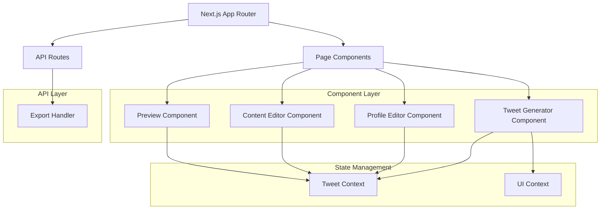
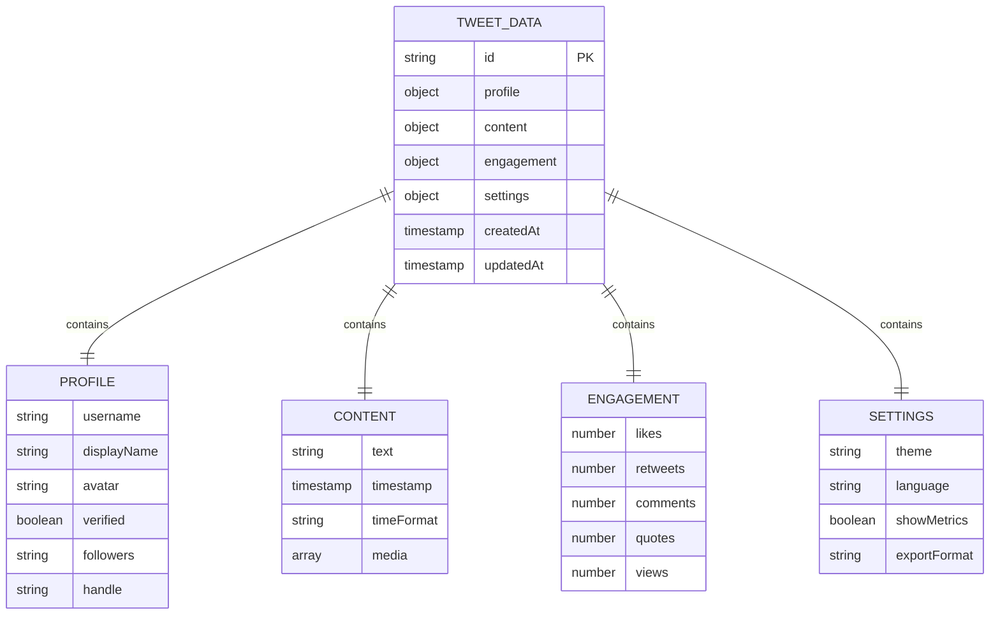

# Fake Tweet Maker - Technical Architecture Document

## 1. Architecture Design



## 2. Technology Description

- Frontend: Next.js@14 + React@18 + TypeScript@5 + Tailwind CSS@3
- State Management: React useState + useContext
- Image Processing: html2canvas@1.4 + Canvas API
- Icons: Heroicons@2 + Lucide React@0.3
- Deployment: Vercel (Static Site Generation)
- Build Tool: Next.js built-in bundler

## 3. Route Definitions

| Route | Purpose |
|-------|---------|
| / | Main tweet generator page with all functionality |
| /api/export | API endpoint for server-side image generation (optional) |

## 4. API Definitions

### 4.1 Core API

Image Export (Optional Server-side)
```
POST /api/export
```

Request:
| Param Name | Param Type | isRequired | Description |
|------------|------------|------------|-------------|
| tweetData | TweetData | true | Complete tweet configuration object |
| format | string | false | Export format (png, jpg) - defaults to png |
| quality | number | false | Image quality 0.1-1.0 - defaults to 1.0 |

Response:
| Param Name | Param Type | Description |
|------------|------------|-------------|
| success | boolean | Export operation status |
| imageUrl | string | Base64 encoded image or download URL |
| error | string | Error message if failed |

Example Request:
```json
{
  "tweetData": {
    "profile": {
      "username": "elonmusk",
      "displayName": "Elon Musk",
      "avatar": "data:image/jpeg;base64,...",
      "verified": true,
      "followers": "150.2M"
    },
    "content": {
      "text": "Just launched another rocket! 🚀",
      "timestamp": "2024-01-15T10:30:00Z"
    },
    "engagement": {
      "likes": 125000,
      "retweets": 45000,
      "comments": 8500,
      "quotes": 2100
    }
  },
  "format": "png",
  "quality": 1.0
}
```

## 5. Server Architecture Diagram



## 6. Data Model

### 6.1 Data Model Definition



### 6.2 Data Definition Language

TypeScript Interface Definitions:

```typescript
// Core Tweet Data Structure
interface TweetData {
  id: string;
  profile: ProfileData;
  content: ContentData;
  engagement: EngagementData;
  settings: SettingsData;
  createdAt: Date;
  updatedAt: Date;
}

// Profile Information
interface ProfileData {
  username: string;
  displayName: string;
  avatar: string; // Base64 or URL
  verified: boolean;
  followers: string; // Formatted string like "150.2M"
  handle: string; // @username format
}

// Tweet Content
interface ContentData {
  text: string;
  timestamp: Date;
  timeFormat: 'relative' | 'absolute';
  media?: MediaData[];
}

// Engagement Metrics
interface EngagementData {
  likes: number;
  retweets: number;
  comments: number;
  quotes: number;
  views?: number;
}

// Application Settings
interface SettingsData {
  theme: 'light' | 'dark';
  language: string;
  showMetrics: boolean;
  exportFormat: 'png' | 'jpg';
}

// Media Attachments (Future Enhancement)
interface MediaData {
  type: 'image' | 'video' | 'gif';
  url: string;
  alt?: string;
}

// Export Configuration
interface ExportConfig {
  format: 'png' | 'jpg';
  quality: number; // 0.1 to 1.0
  width?: number;
  height?: number;
  scale: number; // For high-DPI exports
}
```

Local Storage Schema:
```typescript
// Stored in localStorage for persistence
interface StoredTweetData {
  currentTweet: TweetData;
  recentTweets: TweetData[];
  userPreferences: SettingsData;
  lastExportConfig: ExportConfig;
}
```

Component Props Interfaces:
```typescript
interface TweetPreviewProps {
  tweetData: TweetData;
  className?: string;
  scale?: number;
}

interface ProfileEditorProps {
  profile: ProfileData;
  onProfileChange: (profile: ProfileData) => void;
}

interface ContentEditorProps {
  content: ContentData;
  onContentChange: (content: ContentData) => void;
  maxLength?: number;
}

interface EngagementEditorProps {
  engagement: EngagementData;
  onEngagementChange: (engagement: EngagementData) => void;
}
```
