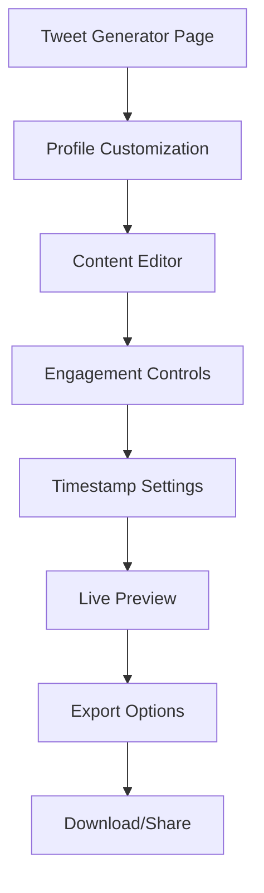

# Fake Tweet Maker - Product Requirements Document

## 1. Product Overview
A web-based fake tweet generator that creates authentic-looking Twitter posts for presentations, social media mockups, and creative projects. <mcreference link="https://superx.so/tools/fake-tweet-maker/" index="0">0</mcreference>

Users can customize every aspect of a tweet including profile information, content, engagement metrics, and timestamps to create pixel-perfect Twitter mockups without registration requirements.

The product targets content creators, marketers, designers, and educators who need realistic Twitter mockups for professional presentations and social media strategies.

## 2. Core Features

### 2.1 User Roles
No user registration required - single anonymous user role with full access to all features.

### 2.2 Feature Module
Our fake tweet maker consists of the following main pages:
1. **Tweet Generator Page**: profile customization, tweet content editor, engagement metrics controls, timestamp settings, live preview, export functionality.

### 2.3 Page Details

| Page Name | Module Name | Feature description |
|-----------|-------------|---------------------|
| Tweet Generator | Profile Customization | Edit username, display name, profile picture upload, verification badge toggle, follower count display |
| Tweet Generator | Content Editor | Tweet text input with 280 character limit, real-time character counter, line break support, emoji picker |
| Tweet Generator | Engagement Controls | Editable like count, retweet count, comment count, quote tweet count with realistic number formatting |
| Tweet Generator | Timestamp Settings | Custom date and time picker, relative time display options (e.g., "2h ago", "Dec 15"), timezone support |
| Tweet Generator | Live Preview | Real-time Twitter-like preview, responsive design preview, dark/light mode toggle |
| Tweet Generator | Export Functionality | Download as PNG/JPG, copy to clipboard, share link generation, high-resolution export options |

## 3. Core Process

**Main User Flow:**
1. User lands on the tweet generator page
2. User customizes profile information (username, display name, profile picture, verification status)
3. User enters tweet content with real-time character counting
4. User adjusts engagement metrics (likes, retweets, comments)
5. User sets custom timestamp or uses current time
6. User previews the generated tweet in real-time
7. User exports the tweet as image or copies to clipboard

## 4. User Interface Design

### 4.1 Design Style
- **Primary Colors**: Twitter Blue (#1DA1F2), Dark Gray (#14171A), Light Gray (#657786)
- **Secondary Colors**: White (#FFFFFF), Success Green (#1D9BF0), Error Red (#F91880)
- **Button Style**: Rounded corners (8px), subtle shadows, hover animations
- **Font**: System fonts (SF Pro Display, Segoe UI, Roboto) with 14px-16px base size
- **Layout Style**: Split-screen design with controls on left, preview on right, responsive card-based layout
- **Icons**: Twitter-style icons, Heroicons for UI elements, custom verification badge

### 4.2 Page Design Overview

| Page Name | Module Name | UI Elements |
|-----------|-------------|-------------|
| Tweet Generator | Profile Customization | Avatar upload area with drag-drop, input fields with Twitter-style borders, toggle switches for verification, follower count slider |
| Tweet Generator | Content Editor | Textarea with Twitter styling, character counter (green/yellow/red states), emoji picker button, auto-resize functionality |
| Tweet Generator | Engagement Controls | Number inputs with Twitter-style formatting, increment/decrement buttons, realistic number abbreviations (1.2K, 5.6M) |
| Tweet Generator | Timestamp Settings | Date/time picker with Twitter-style dropdown, preset options ("2h ago", "1d ago"), timezone selector |
| Tweet Generator | Live Preview | Exact Twitter post replica, responsive preview modes, dark/light theme toggle, zoom controls |
| Tweet Generator | Export Functionality | Download buttons with file format options, copy button with success feedback, share modal with social links |

### 4.3 Responsiveness
Mobile-first responsive design with breakpoints at 768px and 1024px. Touch-optimized controls for mobile devices with larger tap targets and swipe gestures for preview modes.
